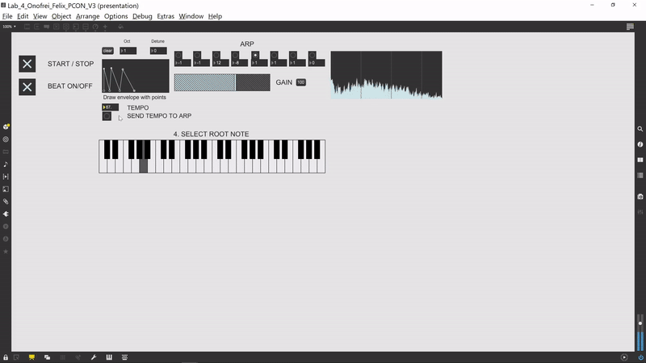
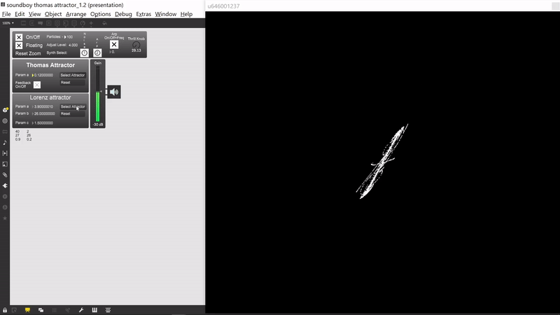

# Max-MSP-Projects
Here you will find some cool and creative Max-MSP Projects

## OSC Sword
It is a 3d modeled sword in blender controlled with my phone and a fake sword for fun.:)
The sword is controlled via OSC Messages (via local network). Android phone app used is OscHook.
As for the blender part, the OSC Messages are recieved and scaled accordingly through Cycling '74 Max-MSP.

## Basic Arp
Basic arp that has drums overlay. It is a very basic arp, made only using delayed bangs.

## Sonification and Visualisation of Chaotic Attractors
There are two attractors that I implemented, Lorenz and Thomas. There are two sonification algorithms. One implies filtered noise and the other is using oscillators and arpegiators.

- Thomas Attractor

- Lorenz Attractor

